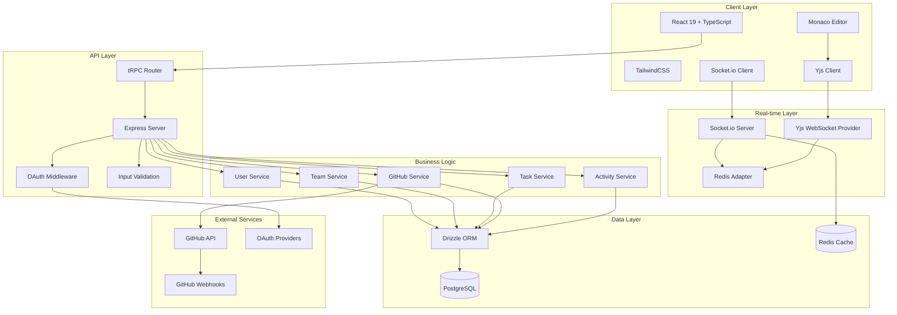

# Design Document: Collaborative Development Platform

## Overview

The collaborative development platform is a full-stack TypeScript application that enables real-time team collaboration on software development projects. The system integrates task management through Kanban boards, GitHub repository monitoring, collaborative code editing, and team activity tracking.

The architecture follows a client-server model with real-time synchronization capabilities. The frontend uses React 19 with TypeScript for type safety, while the backend leverages Node.js with Express and tRPC for end-to-end type safety. Real-time features are powered by Socket.io for general updates and Yjs for collaborative text editing using Conflict-Free Replicated Data Types (CRDTs).

Key design principles include:
- **Type Safety**: End-to-end TypeScript with tRPC ensuring compile-time error detection
- **Real-time Synchronization**: Immediate updates across all connected clients
- **Scalable Architecture**: Modular design supporting horizontal scaling
- **Security First**: OAuth integration, encrypted token storage, and input validation
- **Offline Resilience**: Yjs provides offline editing with automatic synchronization

## Architecture

### System Architecture



### Technology Stack Rationale

**Frontend Technologies:**
- **React 19**: Latest version with improved concurrent features and server components support
- **TypeScript**: Compile-time type checking and enhanced developer experience
- **TailwindCSS**: Utility-first CSS framework for rapid UI development
- **Monaco Editor**: VS Code's editor with rich language support and extensibility
- **Socket.io Client**: Real-time communication with automatic reconnection and fallback transport

**Backend Technologies:**
- **Node.js + Express**: Mature, performant runtime with extensive ecosystem
- **tRPC**: End-to-end type safety without code generation, leveraging TypeScript inference
- **Drizzle ORM**: Type-safe database operations with excellent TypeScript integration
- **PostgreSQL**: ACID-compliant relational database with JSON support for flexible schemas

**Real-time Technologies:**
- **Socket.io**: Robust WebSocket abstraction with room-based broadcasting and scaling support
- **Yjs**: CRDT-based collaborative editing framework enabling conflict-free concurrent editing
- **Redis**: In-memory data store for Socket.io adapter and caching layer

## Components and Interfaces

### Core Components

#### Authentication System
```typescript
interface AuthService {
  authenticateOAuth(provider: OAuthProvider, code: string): Promise<AuthResult>
  validateSession(token: string): Promise<User | null>
  refreshToken(refreshToken: string): Promise<AuthResult>
  revokeSession(token: string): Promise<void>
}

interface OAuthProvider {
  name: 'github' | 'google' | 'manus'
  clientId: string
  clientSecret: string
  redirectUri: string
}

interface AuthResult {
  user: User
  accessToken: string
  refreshToken: string
  expiresAt: Date
}
```

#### Team Management System
```typescript
interface TeamService {
  createTeam(name: string, ownerId: string): Promise<Team>
  inviteUser(teamId: string, email: string, role: TeamRole): Promise<Invitation>
  updateMemberRole(teamId: string, userId: string, role: TeamRole): Promise<void>
  removeMember(teamId: string, userId: string): Promise<void>
  getTeamMembers(teamId: string): Promise<TeamMember[]>
}

interface Team {
  id: string
  name: string
  ownerId: string
  createdAt: Date
  updatedAt: Date
}

interface TeamMember {
  userId: string
  teamId: string
  role: TeamRole
  joinedAt: Date
}

type TeamRole = 'admin' | 'team_lead' | 'developer' | 'viewer'
```

#### Task Management System
```typescript
interface TaskService {
  createTask(task: CreateTaskInput): Promise<Task>
  updateTask(taskId: string, updates: UpdateTaskInput): Promise<Task>
  moveTask(taskId: string, columnId: string, position: number): Promise<void>
  assignTask(taskId: string, assigneeId: string): Promise<void>
  linkGitHubPR(taskId: string, prUrl: string): Promise<void>
}

interface Task {
  id: string
  title: string
  description: string
  assigneeId?: string
  priority: TaskPriority
  status: TaskStatus
  dueDate?: Date
  githubPrUrl?: string
  teamId: string
  createdAt: Date
  updatedAt: Date
}

type TaskPriority = 'low' | 'medium' | 'high' | 'urgent'
type TaskStatus = 'todo' | 'in_progress' | 'review' | 'done'
```

#### Collaborative Editor System
```typescript
interface CollaborativeEditorService {
  createDocument(teamId: string, name: string, content: string): Promise<Document>
  getDocument(documentId: string): Promise<Document>
  updateDocument(documentId: string, yjsUpdate: Uint8Array): Promise<void>
  getActiveUsers(documentId: string): Promise<ActiveUser[]>
}

interface Document {
  id: string
  name: string
  teamId: string
  yjsState: Uint8Array
  createdAt: Date
  updatedAt: Date
}

interface ActiveUser {
  userId: string
  username: string
  cursorPosition: number
  selectionRange: [number, number]
  color: string
}
```

#### GitHub Integration System
```typescript
interface GitHubService {
  connectRepository(teamId: string, repoUrl: string, accessToken: string): Promise<Repository>
  syncRepository(repositoryId: string): Promise<void>
  handleWebhook(payload: GitHubWebhookPayload): Promise<void>
  getRepositoryData(repositoryId: string): Promise<RepositoryData>
}

interface Repository {
  id: string
  teamId: string
  githubId: number
  name: string
  fullName: string
  url: string
  accessToken: string
  webhookSecret: string
  createdAt: Date
}

interface RepositoryData {
  commits: Commit[]
  pullRequests: PullRequest[]
  issues: Issue[]
  branches: Branch[]
}
```

### Real-time Communication Interfaces

#### Socket.io Events
```typescript
interface ServerToClientEvents {
  taskUpdated: (task: Task) => void
  taskMoved: (taskId: string, columnId: string, position: number) => void
  userJoined: (user: User, teamId: string) => void
  userLeft: (userId: string, teamId: string) => void
  activityCreated: (activity: Activity) => void
  repositoryUpdated: (repositoryId: string, data: RepositoryData) => void
}

interface ClientToServerEvents {
  joinTeam: (teamId: string) => void
  leaveTeam: (teamId: string) => void
  joinDocument: (documentId: string) => void
  leaveDocument: (documentId: string) => void
}
```

#### Yjs Integration
```typescript
interface YjsProvider {
  connect(documentId: string): Y.Doc
  disconnect(documentId: string): void
  onUpdate(documentId: string, callback: (update: Uint8Array) => void): void
  broadcastUpdate(documentId: string, update: Uint8Array): void
}
```

## Data Models

### Database Schema

```typescript
// Users table
interface User {
  id: string // UUID primary key
  email: string // Unique, not null
  username: string // Unique, not null
  fullName: string
  avatarUrl?: string
  githubId?: string
  googleId?: string
  manusId?: string
  createdAt: Date
  updatedAt: Date
}

// Teams table
interface Team {
  id: string // UUID primary key
  name: string // Not null
  description?: string
  ownerId: string // Foreign key to users.id
  createdAt: Date
  updatedAt: Date
}

// Team members junction table
interface TeamMember {
  id: string // UUID primary key
  teamId: string // Foreign key to teams.id
  userId: string // Foreign key to users.id
  role: TeamRole // Enum: admin, team_lead, developer, viewer
  joinedAt: Date
}

// Tasks table
interface Task {
  id: string // UUID primary key
  title: string // Not null
  description: string
  assigneeId?: string // Foreign key to users.id
  priority: TaskPriority // Enum: low, medium, high, urgent
  status: TaskStatus // Enum: todo, in_progress, review, done
  dueDate?: Date
  githubPrUrl?: string
  teamId: string // Foreign key to teams.id
  position: number // For ordering within columns
  createdAt: Date
  updatedAt: Date
}

// Documents table for collaborative editing
interface Document {
  id: string // UUID primary key
  name: string // Not null
  teamId: string // Foreign key to teams.id
  yjsState: Buffer // Yjs document state
  createdAt: Date
  updatedAt: Date
}

// GitHub repositories table
interface Repository {
  id: string // UUID primary key
  teamId: string // Foreign key to teams.id
  githubId: number // GitHub repository ID
  name: string // Repository name
  fullName: string // owner/repo format
  url: string // GitHub URL
  accessToken: string // Encrypted GitHub access token
  webhookSecret: string // Webhook validation secret
  lastSyncAt?: Date
  createdAt: Date
  updatedAt: Date
}

// Activities table for feed
interface Activity {
  id: string // UUID primary key
  teamId: string // Foreign key to teams.id
  userId: string // Foreign key to users.id
  type: ActivityType // Enum: task_created, task_updated, commit_pushed, pr_opened, etc.
  entityId: string // ID of related entity (task, commit, PR)
  entityType: string // Type of related entity
  metadata: Record<string, any> // JSON metadata
  createdAt: Date
}

// OAuth tokens table
interface OAuthToken {
  id: string // UUID primary key
  userId: string // Foreign key to users.id
  provider: OAuthProvider // Enum: github, google, manus
  accessToken: string // Encrypted access token
  refreshToken?: string // Encrypted refresh token
  expiresAt?: Date
  createdAt: Date
  updatedAt: Date
}
```

### Database Indexes

```sql
-- Performance indexes
CREATE INDEX idx_team_members_team_id ON team_members(team_id);
CREATE INDEX idx_team_members_user_id ON team_members(user_id);
CREATE INDEX idx_tasks_team_id ON tasks(team_id);
CREATE INDEX idx_tasks_assignee_id ON tasks(assignee_id);
CREATE INDEX idx_tasks_status ON tasks(status);
CREATE INDEX idx_activities_team_id_created_at ON activities(team_id, created_at DESC);
CREATE INDEX idx_repositories_team_id ON repositories(team_id);
CREATE INDEX idx_oauth_tokens_user_provider ON oauth_tokens(user_id, provider);

-- Unique constraints
ALTER TABLE users ADD CONSTRAINT unique_email UNIQUE (email);
ALTER TABLE users ADD CONSTRAINT unique_username UNIQUE (username);
ALTER TABLE team_members ADD CONSTRAINT unique_team_user UNIQUE (team_id, user_id);
ALTER TABLE repositories ADD CONSTRAINT unique_team_github_repo UNIQUE (team_id, github_id);
```

## Correctness Properties

*A property is a characteristic or behavior that should hold true across all valid executions of a system—essentially, a formal statement about what the system should do. Properties serve as the bridge between human-readable specifications and machine-verifiable correctness guarantees.*

### Authentication and Security Properties

**Property 1: OAuth Token Security**
*For any* OAuth authentication flow, all stored tokens should be encrypted in the database and properly invalidated upon logout
**Validates: Requirements 1.3, 1.5, 1.6**

**Property 2: Input Validation Security**
*For any* user input across all endpoints, the platform should validate and sanitize the input to prevent security vulnerabilities
**Validates: Requirements 8.6**

**Property 3: Rate Limiting Protection**
*For any* API endpoint, when requests exceed the configured rate limit, the platform should reject additional requests until the limit resets
**Validates: Requirements 8.4**

**Property 4: Secure Error Logging**
*For any* error that occurs in the system, the logged error should not contain sensitive information like tokens or passwords
**Validates: Requirements 8.5**

### Team Management Properties

**Property 5: Team Creation Admin Assignment**
*For any* authenticated user who creates a team, they should automatically be assigned the Admin role for that team
**Validates: Requirements 2.1**

**Property 6: Role-Based Access Control**
*For any* team operation, the platform should enforce permissions based on the user's role, rejecting unauthorized actions
**Validates: Requirements 2.6**

**Property 7: Team Invitation Workflow**
*For any* team invitation sent by an Admin, accepting the invitation should add the user to the team with the specified role
**Validates: Requirements 2.2, 2.3**

**Property 8: Role Change Immediate Effect**
*For any* role change made by an Admin, the member's permissions should be updated immediately across all active sessions
**Validates: Requirements 2.4**

**Property 9: Member Removal Access Revocation**
*For any* team member removed by an Admin, their access to all team resources should be immediately revoked
**Validates: Requirements 2.5**

### Task Management Properties

**Property 10: Task Creation Authorization**
*For any* user with Developer role or higher, creating a task should successfully add it to the appropriate board column
**Validates: Requirements 3.1**

**Property 11: Real-time Task Synchronization**
*For any* task update (movement, details, assignment), all team members viewing the board should receive the update in real-time
**Validates: Requirements 3.2, 3.3, 3.4**

**Property 12: Task History Preservation**
*For any* task modification, the platform should maintain a complete history of state transitions and changes
**Validates: Requirements 3.5**

**Property 13: Task Assignment Notification**
*For any* task assignment, the assignee should receive a notification about the assignment
**Validates: Requirements 3.6**

### GitHub Integration Properties

**Property 14: Repository Connection Metadata Storage**
*For any* GitHub repository connection, the platform should authenticate with GitHub and store complete repository metadata
**Validates: Requirements 4.1**

**Property 15: Webhook Event Processing**
*For any* valid GitHub webhook event, the platform should process and update the corresponding commits, pull requests, or issues data
**Validates: Requirements 4.2**

**Property 16: Repository Dashboard Completeness**
*For any* repository dashboard view, the display should include recent commits, open pull requests, and issues
**Validates: Requirements 4.3**

**Property 17: GitHub PR Task Linking**
*For any* GitHub pull request linked to a task, the platform should create and maintain a bidirectional association
**Validates: Requirements 4.4**

**Property 18: Repository Data Refresh**
*For any* connected repository, the platform should refresh data both periodically and when webhook events are received
**Validates: Requirements 4.5**

### Collaborative Editing Properties

**Property 19: Collaborative Session Initialization**
*For any* file opened in the editor, the platform should initialize a Yjs collaborative editing session
**Validates: Requirements 5.1**

**Property 20: Multi-user Edit Synchronization**
*For any* collaborative editing session with multiple users, all changes should be synchronized in real-time across all participants
**Validates: Requirements 5.2**

**Property 21: User Presence Visibility**
*For any* active collaborative editing session, each user's cursor position and selection should be visible to all other participants
**Validates: Requirements 5.3**

**Property 22: Session State Loading**
*For any* user joining an active editing session, they should receive the current complete document state
**Validates: Requirements 5.4**

**Property 23: Editor Feature Preservation**
*For any* collaborative editing session, Monaco Editor features like syntax highlighting should remain functional
**Validates: Requirements 5.5**

**Property 24: Offline Resilience**
*For any* network disconnection during editing, changes should be queued locally and synchronized when connectivity is restored
**Validates: Requirements 5.6**

### Activity Feed Properties

**Property 25: Activity Recording Completeness**
*For any* team activity (commits, PRs, task updates), the platform should record it in the activity feed
**Validates: Requirements 6.1**

**Property 26: Activity Chronological Ordering**
*For any* activity feed view, activities should be displayed in chronological order from newest to oldest
**Validates: Requirements 6.2**

**Property 27: Activity Filtering Accuracy**
*For any* activity filter applied (by member or type), only activities matching the filter criteria should be displayed
**Validates: Requirements 6.3**

**Property 28: Real-time Activity Updates**
*For any* new activity, all users currently viewing the activity feed should receive the update in real-time
**Validates: Requirements 6.4**

**Property 29: Activity Aggregation**
*For any* sequence of similar activities, the platform should aggregate them to reduce feed noise
**Validates: Requirements 6.5**

**Property 30: Activity Archival**
*For any* activities older than the configured retention period, the platform should archive them
**Validates: Requirements 6.6**

### Code Review Properties

**Property 31: PR Diff Display Completeness**
*For any* linked GitHub pull request, the platform should display the complete diff with syntax highlighting
**Validates: Requirements 7.1**

**Property 32: Code Comment Synchronization**
*For any* comment added to code lines, the platform should store it locally and synchronize with GitHub
**Validates: Requirements 7.2**

**Property 33: PR Status Synchronization**
*For any* pull request approval or change request, the status should be updated both on GitHub and in the linked task
**Validates: Requirements 7.3, 7.4**

**Property 34: Review Status Visibility**
*For any* pull request, the platform should display the current review status and approval workflow progress
**Validates: Requirements 7.5**

**Property 35: Conflict Highlighting**
*For any* pull request with merge conflicts, the platform should highlight conflicts and provide resolution guidance
**Validates: Requirements 7.6**

### Serialization Properties

**Property 36: JSON Round-trip Consistency**
*For any* valid typed object, serializing to JSON then parsing back should produce an equivalent object
**Validates: Requirements 9.4**

**Property 37: JSON Error Handling**
*For any* invalid JSON input, the parser should return descriptive error messages without crashing
**Validates: Requirements 9.2**

**Property 38: Configuration Round-trip Consistency**
*For any* valid Configuration object, printing to file format then parsing back should produce an equivalent object
**Validates: Requirements 9.8**

**Property 39: Webhook Payload Validation**
*For any* GitHub webhook payload, the platform should validate it against GitHub's schema before processing
**Validates: Requirements 9.5**

## Error Handling

### Error Classification and Response Strategy

The platform implements a comprehensive error handling strategy that categorizes errors by type and provides appropriate responses:

#### Authentication Errors
- **OAuth Provider Failures**: Graceful fallback to alternative providers or manual registration
- **Token Expiration**: Automatic refresh attempts with user notification if refresh fails
- **Invalid Sessions**: Immediate redirect to login with session cleanup
- **Rate Limiting**: Clear messaging about limits with retry timing information

#### Team Management Errors
- **Permission Denied**: Clear role-based error messages explaining required permissions
- **Invalid Invitations**: Validation errors with specific field feedback
- **Team Capacity Limits**: Informative messages about team size restrictions
- **Duplicate Operations**: Idempotent handling with appropriate user feedback

#### Task Management Errors
- **Concurrent Modifications**: Conflict resolution with user choice for resolution
- **Invalid State Transitions**: Clear validation messages about allowed transitions
- **Assignment Failures**: Notification to both assignor and assignee about failures
- **Real-time Sync Failures**: Automatic retry with offline mode fallback

#### GitHub Integration Errors
- **API Rate Limits**: Intelligent backoff with user notification about delays
- **Repository Access Revoked**: Clear messaging with re-authentication options
- **Webhook Validation Failures**: Secure logging without exposing sensitive data
- **Sync Conflicts**: User-guided resolution with conflict visualization

#### Collaborative Editing Errors
- **Network Disconnections**: Offline mode with change queuing and sync indicators
- **Yjs Sync Failures**: Automatic recovery with document state validation
- **Large Document Handling**: Progressive loading with performance warnings
- **Concurrent Edit Conflicts**: CRDT-based automatic resolution

#### Data Layer Errors
- **Database Connection Failures**: Connection pooling with automatic retry
- **Transaction Failures**: Rollback with user notification and retry options
- **Data Validation Errors**: Field-specific error messages with correction guidance
- **Migration Failures**: Safe rollback with administrator notification

### Error Response Format

```typescript
interface ErrorResponse {
  error: {
    code: string // Machine-readable error code
    message: string // Human-readable error message
    details?: Record<string, any> // Additional context
    retryable: boolean // Whether the operation can be retried
    timestamp: Date // When the error occurred
  }
}
```

### Logging and Monitoring

- **Structured Logging**: JSON-formatted logs with correlation IDs
- **Error Aggregation**: Similar errors grouped to identify patterns
- **Performance Monitoring**: Response time tracking with alerting
- **Security Event Logging**: Authentication failures and suspicious activity
- **User Activity Tracking**: Non-PII activity logs for debugging

## Testing Strategy

### Dual Testing Approach

The platform employs both unit testing and property-based testing to ensure comprehensive coverage:

**Unit Tests**: Focus on specific examples, edge cases, and integration points
- Authentication flow edge cases (expired tokens, invalid providers)
- Team management boundary conditions (role transitions, member limits)
- Task state validation (invalid transitions, permission checks)
- GitHub webhook payload parsing (malformed data, missing fields)
- Real-time synchronization scenarios (network failures, concurrent updates)

**Property-Based Tests**: Verify universal properties across all inputs
- OAuth token security and encryption (Property 1)
- Role-based access control enforcement (Property 6)
- Real-time synchronization consistency (Property 11, 20)
- Data serialization round-trip integrity (Property 36, 38)
- Activity feed ordering and filtering (Property 26, 27)

### Property-Based Testing Configuration

**Testing Framework**: Fast-check for TypeScript/JavaScript property-based testing
- **Minimum 100 iterations** per property test to ensure comprehensive input coverage
- **Custom generators** for domain-specific data types (users, teams, tasks, repositories)
- **Shrinking support** to find minimal failing examples when tests fail

**Test Organization**:
```typescript
// Example property test structure
describe('Team Management Properties', () => {
  it('Property 6: Role-Based Access Control', () => {
    fc.assert(fc.property(
      fc.record({
        user: userGenerator(),
        team: teamGenerator(),
        operation: operationGenerator(),
        role: fc.constantFrom('admin', 'team_lead', 'developer', 'viewer')
      }),
      ({ user, team, operation, role }) => {
        // Test that permissions are properly enforced
        const hasPermission = checkPermission(user, team, operation, role)
        const operationResult = performOperation(user, team, operation)
        
        if (hasPermission) {
          expect(operationResult.success).toBe(true)
        } else {
          expect(operationResult.success).toBe(false)
          expect(operationResult.error.code).toBe('INSUFFICIENT_PERMISSIONS')
        }
      }
    ), { numRuns: 100 })
  })
})
```

**Test Tags**: Each property test references its design document property
- Format: `Feature: collaborative-dev-platform, Property {number}: {property_text}`
- Example: `Feature: collaborative-dev-platform, Property 1: OAuth Token Security`

### Integration Testing Strategy

**Real-time Communication Testing**:
- Socket.io event propagation across multiple simulated clients
- Yjs collaborative editing with concurrent operations
- Network partition simulation and recovery testing

**GitHub Integration Testing**:
- Webhook endpoint testing with GitHub's webhook payload examples
- OAuth flow testing with GitHub's test environment
- Repository synchronization testing with mock GitHub API responses

**Database Testing**:
- Transaction isolation testing with concurrent operations
- Migration testing with schema evolution scenarios
- Performance testing with large datasets and complex queries

**Security Testing**:
- Input validation testing with malicious payloads
- Authentication bypass attempt testing
- Rate limiting effectiveness testing
- Token encryption and secure storage validation

### Performance Testing

**Load Testing Scenarios**:
- Concurrent user sessions (target: 1000+ simultaneous users)
- Real-time message broadcasting (target: <100ms latency)
- Database query performance (target: <50ms for 95th percentile)
- File upload and collaborative editing (target: <200ms sync time)

**Monitoring and Alerting**:
- Response time monitoring with percentile tracking
- Error rate monitoring with automatic alerting
- Resource utilization monitoring (CPU, memory, database connections)
- Real-time user activity monitoring and capacity planning